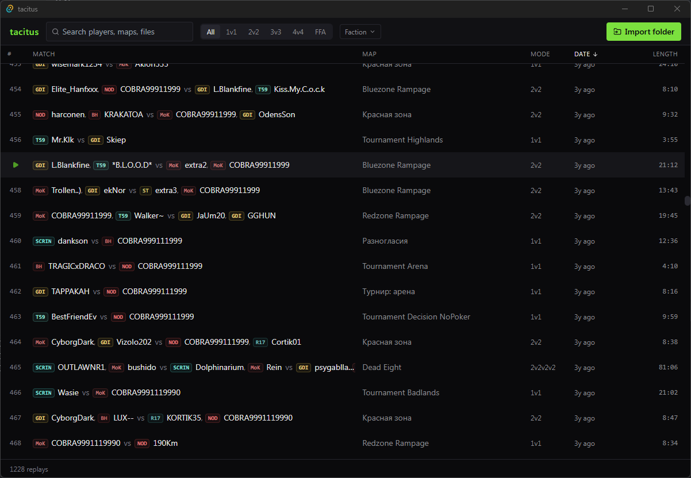

# Tacitus

Tacitus is a replay library and playback manager for **Command & Conquer 3:
Kane's Wrath**. It catalogues `.kwreplay` files, extracts match metadata, and
prepares the exact game content needed to watch a replay in the live engine.



## Current status

Tacitus 0.1.0 is a functional Windows x64 release candidate. The desktop app
can import and browse a replay collection, resolve factions selected through
Random, detect a game installation, obtain supported historical map packs, and
launch a replay with an isolated temporary game configuration.

The portable build is a single executable with the UI, Rust backend, SQLite,
and a private WebView2 runtime embedded. It does not need an installer or a
runtime download when it starts. The executable is currently unsigned; code
signing and clean Windows 10/11 release testing remain before a public release.

## Features

- Recursively import `.kwreplay` files and deduplicate them by SHA-256.
- Parse players, teams, chosen and actual factions, map, game version, date,
  and match duration into a local SQLite catalogue.
- Resolve a player's actual faction when Random was selected in the lobby.
- Search by player, map, or filename; filter by game mode and grouped factions;
  and sort the library by date, map, player count, or duration.
- Require every selected faction when combining faction filters. For example,
  selecting GDI and Nod shows matches containing both factions.
- Detect Steam libraries and common EA/Origin game locations, with a folder
  picker when automatic detection does not find the installation.
- Check exact map paths and compiled compatibility values before playback.
- Reuse installed or cached content and download supported missing map packs.
  Supported ZIP and NSIS packages are read as data; their installers are never
  executed.
- Mount replay content through a temporary configuration without changing the
  user's installed packs or selected game configuration.
- Import, list, search, parse, check, prepare, and launch replays from
  `tacitus-cli`, with structured JSON output where applicable.

## Running the portable build

Tacitus requires Windows x64. Replay playback also requires an installed copy
of Kane's Wrath; browsing and importing replays does not.

Distribute `release/tacitus.exe` by itself. The optional adjacent
`tacitus.exe.sha256` file is checksum metadata and is not required at runtime.
The executable can be moved or renamed.

On first launch, Tacitus extracts its embedded browser runtime into
`%LOCALAPPDATA%\tacitus\runtimes`. This can delay the first window by several
seconds. Later launches reuse that runtime.

Application data is stored separately from the executable:

- `%APPDATA%\tacitus\catalogue.sqlite3` — replay catalogue
- `%APPDATA%\tacitus\launcher.json` — detected or selected game folder
- `%LOCALAPPDATA%\tacitus\playback` — downloaded content and launch sessions

Removing `tacitus.exe` does not remove this data. See the
[portable release notes](docs/portable-release.md) for build internals,
runtime updates, and release validation.

## Using Tacitus

1. Start Tacitus and choose **Import**.
2. Select a folder containing `.kwreplay` files.
3. Search, sort, and filter the resulting library. Faction filters are grouped
   as GDI/ST/ZOCOM, NOD/MoK/BH, and SCRIN/T59/R17.
4. Select a replay and choose **Play**. Tacitus checks the game and required
   content, downloads a supported missing pack when available, and starts the
   replay.

If automatic game detection fails, the playback dialog asks for the Kane's
Wrath installation folder containing `Core` and `RetailExe`. The selected path
is remembered for later launches.

Exact content is deliberately required: a newer map revision, similarly named
map, or thumbnail cannot substitute for the version recorded by the replay.
Unsupported or unavailable historical content is reported instead of guessed.
See [replay playback](docs/replay-launcher.md) for the compatibility model,
supported package formats, cache behavior, and CLI commands.

## Development

Building the desktop application requires Node.js LTS and the current stable
Rust toolchain. On Windows, install the MSVC Rust target and Visual Studio C++
build tools.

```sh
npm install
npm run tauri dev
```

For frontend-only work, Vite serves a browser preview with mock replay data:

```sh
npm run dev
```

Run the regression checks with:

```sh
npm test
npm run build
cargo test --manifest-path src-tauri/Cargo.toml --all-targets
```

The optional real-replay tests read the folder named by
`TACITUS_REPLAY_CORPUS`. Point it at a local collection that includes matches
where players selected Random. Those tests skip when the variable is unset;
the remaining tests use self-contained fixtures.

The Command Post client has separate offline download tests:

```sh
python -m unittest discover -s tools/cp-client/tests -v
```

Reimport existing replay folders to refresh resolved factions, duration, and
absolute file paths. Reimports preserve catalogue IDs and import order.

## Building the portable executable

On Windows:

```sh
npm run build:portable
```

The command downloads and verifies the pinned Microsoft WebView2 Fixed Version
package, builds the application with the static MSVC runtime, and writes
`release/tacitus.exe` plus its SHA-256 file. Subsequent builds reuse the cached
WebView2 package.

## Technology

- [Tauri 2](https://tauri.app/) desktop shell
- Rust parser, playback preparation, downloader, and CLI
- React, TypeScript, and Tailwind UI
- SQLite catalogue through bundled `rusqlite`

## License

Licensed under the [MIT License](./LICENSE).

## Acknowledgements

- [`forcecore/KWReplayAutoSaver`](https://github.com/forcecore/KWReplayAutoSaver)
  — reference parser for the `.KWReplay` binary format
- [`Aquatech5/ReplayTool`](https://github.com/Aquatech5/ReplayTool) — extended
  replay metadata extraction
- [Command Post](https://cgf-uploads.net/cp) — map-pack metadata and historical
  public download sources
